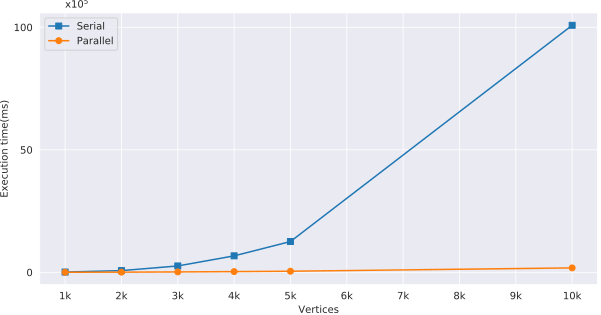

# Parallelization of Ford Fulkerson Max flow algorithm on GPU
This repo contains parallel and serial ford fulkerson implementation. Parallel algorithm is implemented using CUDA with compute
capability 3.5.

### Comparison with CPU implementation



Graph above shows difference between execution times of serial and optimized parallel implementation. As graph size increases the difference between serial and parallel implementations widens. For graph with 10k vertices and around 2.5 million edges, serial implementation takes 2.8 Hours, where as on other hand parallel implementation calculates maxflow for the same graph in just 180 seconds. Thus achieving an speed-up of 56 over serial implementation.

### Code structure
1. src - contains serial and parallel implementation
2. dataset - contains graphs of varying size to find maxflow of.

### Code execution
- Compile src/parallel_ford_fulkerson.cu with nvcc
  ```
  nvcc src/parallel_ford_fulkerson.cu
  ```
- Execute binary generated with dataset file and no. of vertices in that dataset
  ```
  a.out dataset/10000v.in 10000
  ```
